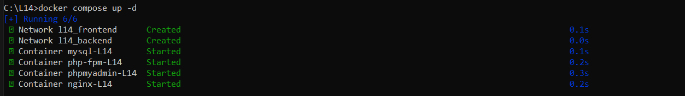
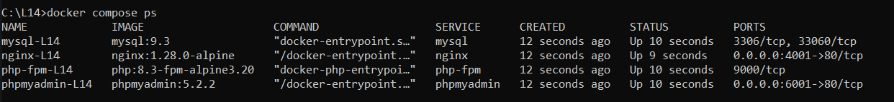
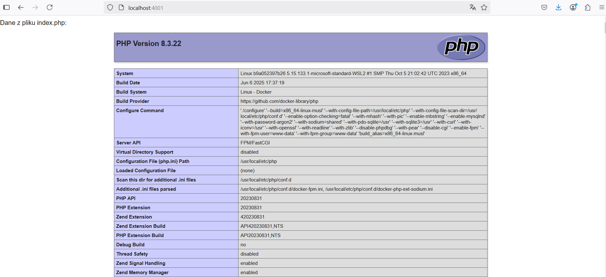
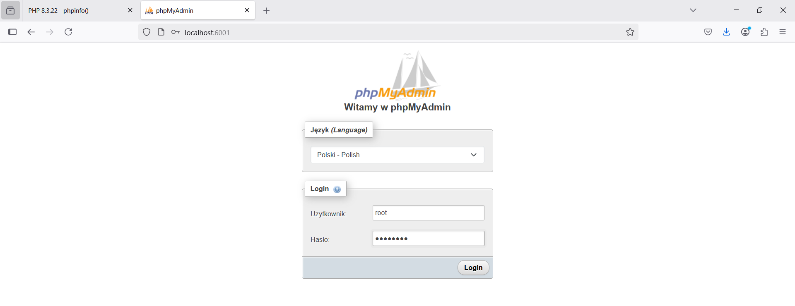
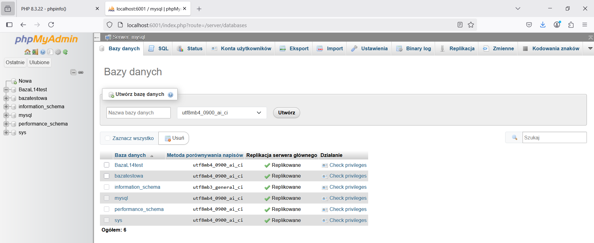

# Sprawozdanie z zadania dodatkowego Laboratorium 14

## Wyjaśnienia
Zadanie zawiera zmodyfikowane rozwiązanie z laboratorium 12 i 13 (repo na GitHub: [https://github.com/99618/L12](https://github.com/99618/L12)).
Modyfikacja dotyczyła pliku docker-compose.yml w którym pozostawiono ustawienia bazowe, a ustawienia środowiskowe 
jak mapowanie portów, czy sposób restartowania kontenerów wydzielono do pliku docker-compose.override.yml.

## Obsługa projektu i sprawdzenie poprawności rozwiązania
Komendy wykonujemy z pozycji katalogu głównego z plikiem docker-compose.yml i docker-compose.override.yml.

### 1. Uruchomienie
  ```bash
  docker compose up -d
  ```
Rezultat:


### 2. Sprawdzenie stanu kontenerów 
  ```bash
  docker compose ps
  ```
Rezultat:


### 3. Sprawdzenie strony index.php w przeglądarce
  Wejście na stronę główną PHP z konfiguracją serwera PHP na serwerze ([http://localhost:4001](http://localhost:4001))


### 4. Sprawdzenie strony phpMyAdmin w przeglądarce
  Wejście na stronę główną phpMyAdmin ([http://localhost:6001](http://localhost:6001))


### 5. Sprawdzenie strony phpMyAdmin z zalogowaniem na użytkownika (root)
Po pomyślnym zalogowaniu, widać wcześniej utworzoną bazę "bazatestowa", a z racji tego że mamy uprawnienia do tworzenia baz,
można było utworzyć nową bazę "BazaL14test".

